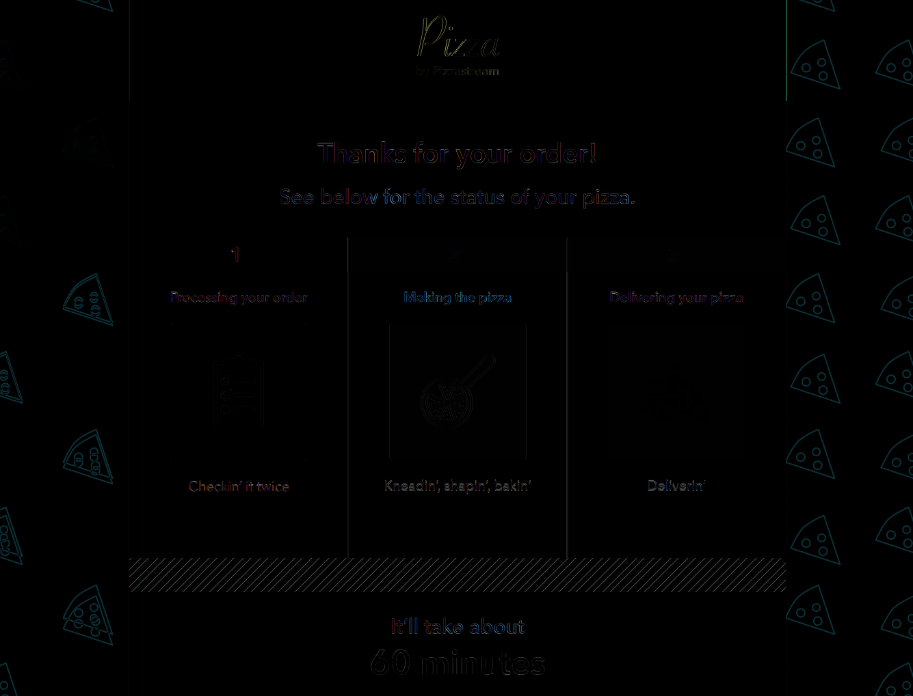
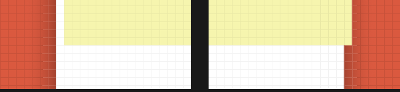
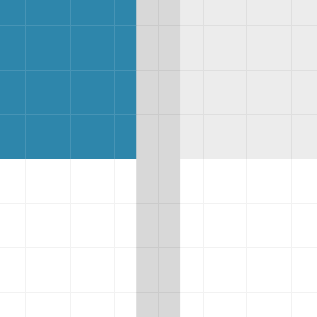
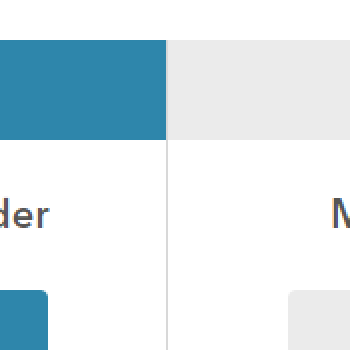

## The final design is deployed on GitHub Pages
### **https://tryandev.github.io/pizzastream/**

# Difference map
| Difference map (brighter pixels represent bigger difference)  |
| ------------- | 
|  |

# Pixel Perfect Design Implementation

1) **The Font**
     - The smaller text is indeed Avenir Next. 
At a closer look, using a demi version of the font can match the mock up better then the regular in bold.

2) **The Header**
    - In the mock up, the yellow header is shifted 1 pixel to the right.
This creates a vertical white line to it's left and pokes out the right by 1 yellow pixel.
In a real world case, this would be a mistake and I have not included it the finished product. (See image below)

| Header (Mock zoomed in)  |
| ------------- | 
|  |

3) **The Panel Seperator**
    - Zoomed in to the mockup (left), the line seperating the 3 panels appears to have be 1 pixel thick,
sitting between 2 pixels. When zoomed out (right), this looks like a 2 pixels thick with half the darkness.
I decided to go with 1 pixel darker version following the zoomed in version of the mockup. (See image below)

| Panel seperator (Mock zoomed in)  | Panel seperator (Mock zoomed out) | Panel seperator (Mine) |
| ------------- | ------------- | ------------- |
|  |  |  |

4) **The Background**
    - The background is covered by a pseudo element, to show that I can bring a background opacity down to 30%
without changing the opacity in the image directly in say photoshop.
    - The right side of the background is purposely mismatched as a continuation of the left,
because using two divs for one background is inefficient and too far from a real world case.
    - For the tiling pattern of the pizza slices, I have two options:
        - [x] **Option 1:** Re-tile the pizza slice in photoshop to match the mock up. The first 3 slices of pizza in the top left match exactly, 
but the rest of the tiling in the mock up is inconsistent, so the rest of the slices can't be matched.
        - [ ] **Option 2:** Don't touch the asset, instead use a background linear gradient trick in css:
This will get you a 2x2 version of the image with only the top-left slice visible, then that 2x2 is tiled. This would only get the implementation somewhat close without changing the asset at all. 
   - (See difference map)

5) **The Animated Loader GIF**
    - The animated loader is 50px tall in the mock up. The gif provided is 41px tall. I picked one of two options:
      - [ ] **Option 1:** Stretch it up uniformly with the drawback of thicker lines and deviating from the mock up
      - [x] **Option 2:** Crop the gif to 25px tall, this height lets it tile, lets you match the thickness to mock up exactly
    - Some CSS opacity blending with it's parent color is done to make the asset colors match the mockup colors exactly.

6) **Responsive Design with Mobile Layout**
    - It goes into a vertical, mobile targeted layout, when under 960px width, which should be lowered for real world cases.
    - In this layout I moved the `It’ll take about 60 minutes` portion to the top.
    - All panels are then stacked vertically, with completed panels removed from view.

7) **Animated Transitions**
    - I added these for fun with a completed state that hides all panels when the delivery timer reaches 0.

# Efficient and Clean Code

1) **CSS Selectors**
    - They are the most efficient when they are one level.
Example: `#myid {}` and `#myclass {}` are more efficient than `#myid .myclass {}`
In this simple app, I've avoided multilevel selectors for the most part and have left a few multilevels to reflect real world scenarios.

2) **Avoid re-renders in ReactJS**
    - Memo was used to avoid re-renders in the panels when only the timer has updated.

